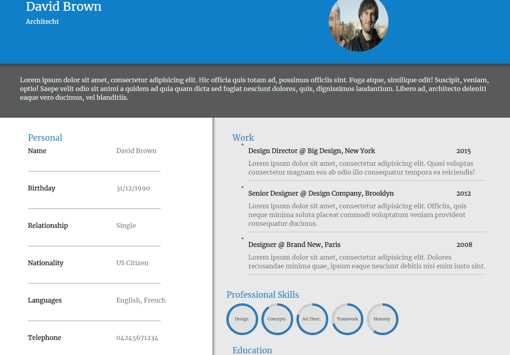

# Resume Template
> Template for a web resume

The template uses Bootstrap, SASS(SCSS) and BEM with SMACSS.

## Installing / Getting started

Just clone the repo and open index.html to see the webpage.
```shell
git clone https://github.com/ArmandoGraterol/resume-design
```
Pre-compiled styles are in the scss folder organized with the SMACSS methodology.

## Features

* Modern and creative template for resumes.
* Responsive with the use of Bootstrap.

## Licensing

The code in this project is licensed under MIT license.